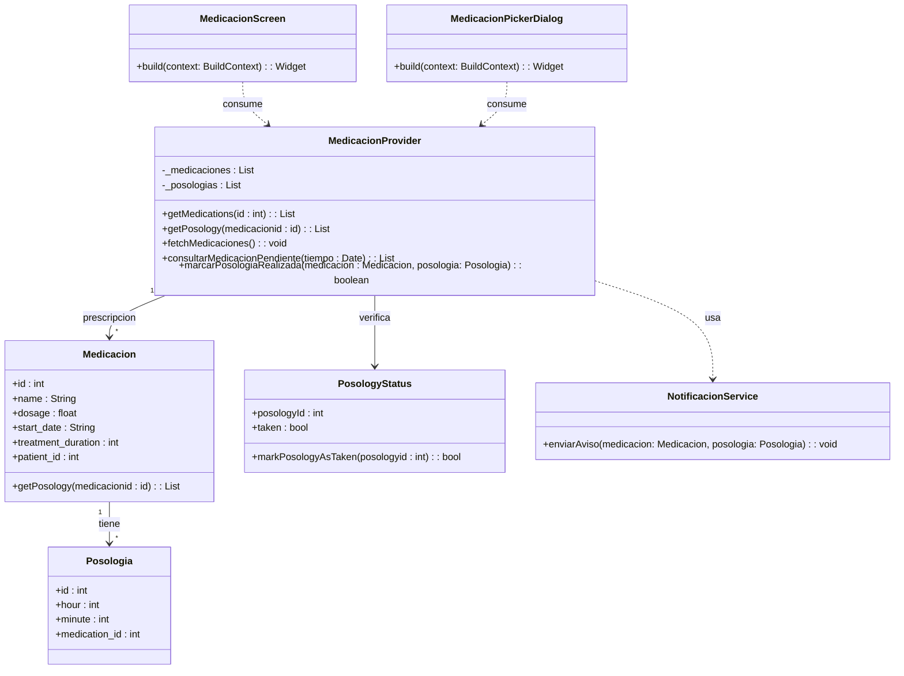

# Diseño software

```mermaid
classDiagram
    class MedicacionProvider {
        -_medicaciones : List
        -_posologias : List
        +getMedications(id : int) : List
        +getPosology(medicacionid : id) : List
        +fetchMedicaciones() : void
        +consultarMedicacionPendiente(tiempo : Date) : List
        +marcarPosologiaRealizada(medicacion : Medicacion, posologia: Posologia) : boolean
    }

    class Medicacion {
        +id : int
        +name : String
        +dosage : float
        +start_date : String
        +treatment_duration : int
        +patient_id : int
        +getPosology(medicacionid : id) : List
    }

    class Posologia {
        +id : int
        +hour : int
        +minute : int
        +medication_id : int
    }

    class PosologyStatus {
        +posologyId : int
        +taken : bool
        +markPosologyAsTaken(posologyid : int) : bool
    }

    class NotificacionService {
        +enviarAviso(medicacion: Medicacion, posologia: Posologia) : void
    }

    class MedicacionScreen {
        +build(context: BuildContext) : Widget
    }

    class MedicacionPickerDialog {
        +build(context: BuildContext) : Widget
    }

    Medicacion "1" --> "*" Posologia : tiene
    MedicacionProvider "1" --> "*" Medicacion : prescripcion
    MedicacionProvider ..> NotificacionService : usa
    MedicacionScreen ..> MedicacionProvider : consume
    MedicacionPickerDialog ..> MedicacionProvider : consume
    MedicacionProvider --> PosologyStatus : verifica

```
