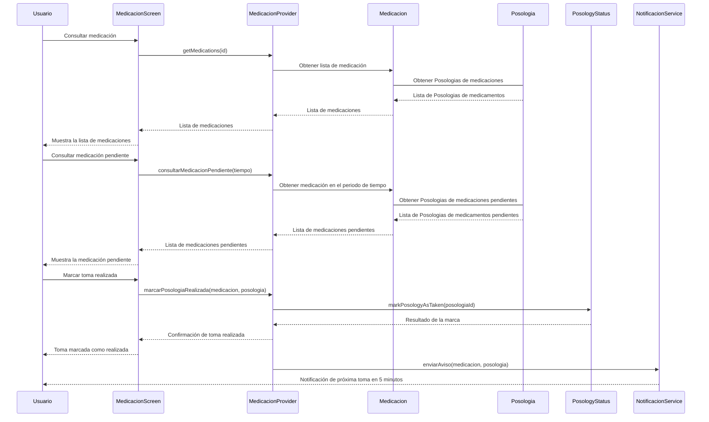

##Diseño software dinámico

```mermaid
sequenceDiagram
    participant Usuario
    participant MedicacionScreen
    participant MedicacionProvider
    participant Medicacion
    participant Posologia
    participant PosologyStatus
    participant NotificacionService

    Usuario->>MedicacionScreen: Consultar medicación
    MedicacionScreen->>MedicacionProvider: getMedications(id)
    MedicacionProvider->>Medicacion: Obtener lista de medicación
        Medicacion -> Posologia: Obtener Posologias de medicaciones
    Posologia -->> Medicacion: Lista de Posologias de medicamentos
    Medicacion-->>MedicacionProvider: Lista de medicaciones
    MedicacionProvider-->>MedicacionScreen: Lista de medicaciones
    MedicacionScreen-->>Usuario: Muestra la lista de medicaciones

    Usuario->>MedicacionScreen: Consultar medicación pendiente
    MedicacionScreen->>MedicacionProvider: consultarMedicacionPendiente(tiempo)
    MedicacionProvider->>Medicacion: Obtener medicación en el periodo de tiempo
    Medicacion -> Posologia: Obtener Posologias de medicaciones pendientes
    Posologia -->> Medicacion: Lista de Posologias de medicamentos pendientes
    Medicacion-->>MedicacionProvider: Lista de medicaciones pendientes
    MedicacionProvider-->>MedicacionScreen: Lista de medicaciones pendientes
    MedicacionScreen-->>Usuario: Muestra la medicación pendiente

    Usuario->>MedicacionScreen: Marcar toma realizada
    MedicacionScreen->>MedicacionProvider: marcarPosologiaRealizada(medicacion, posologia)
    MedicacionProvider->>PosologyStatus: markPosologyAsTaken(posologiaId)
    PosologyStatus-->>MedicacionProvider: Resultado de la marca
    MedicacionProvider-->>MedicacionScreen: Confirmación de toma realizada
    MedicacionScreen-->>Usuario: Toma marcada como realizada

    MedicacionProvider->>NotificacionService: enviarAviso(medicacion, posologia)
    NotificacionService-->>Usuario: Notificación de próxima toma en 5 minutos
```
